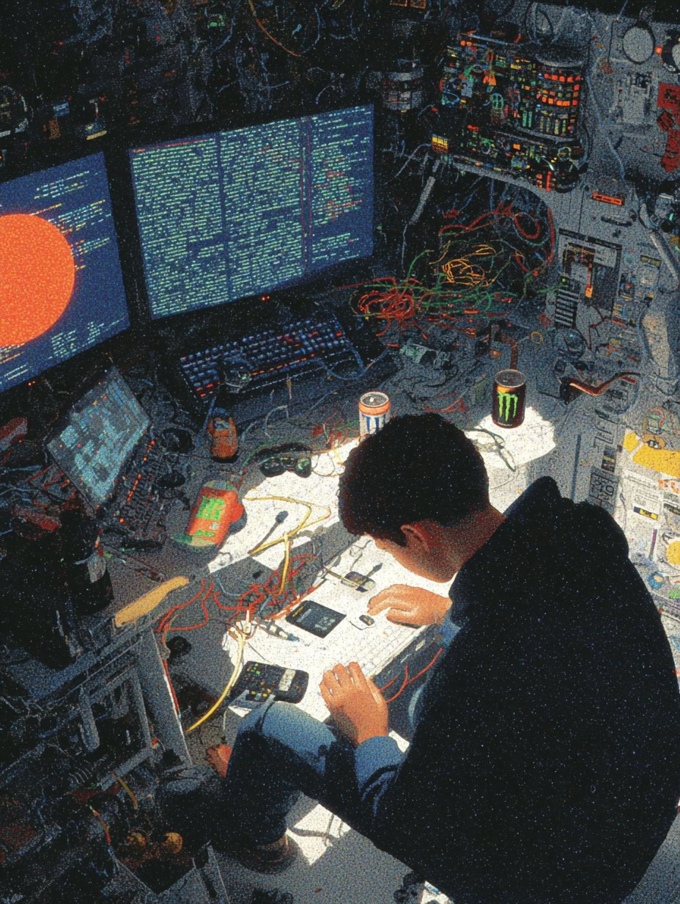

  
<pre>
    💼  Computer Engineering @ UNISINOS • DevOps Enthusiast • Linux Lover
    💻  Infrastructure as Code • Cloud • Automation • Containers
    🐧  Linux • Shell Scripting • Docker • Terraform • Ansible
    🧠  Reinforcement Learning • Python • Machine Learning
    🛠️  Hardware experiments • System tinkering • Self-hosting fun
</pre>
  

   
    

